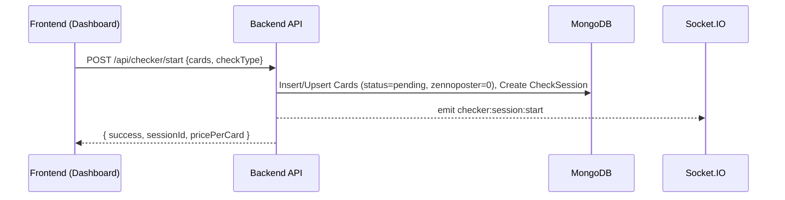
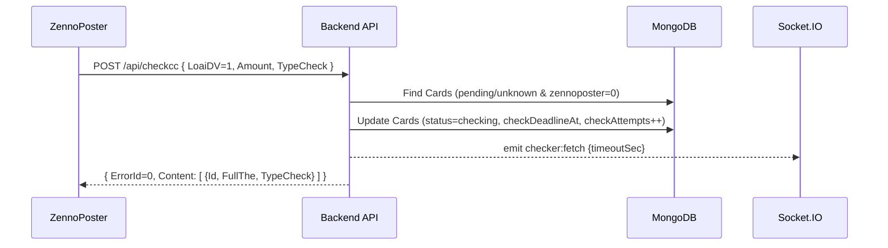
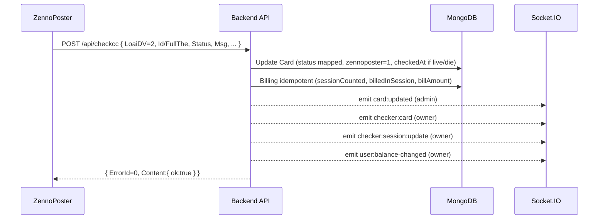
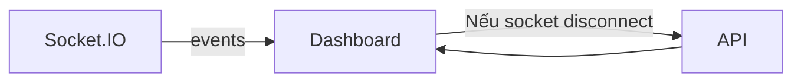
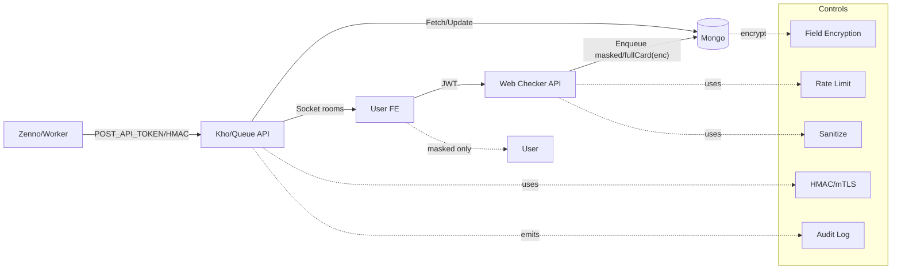

# Checker Architecture & Realtime Flow

## Mục tiêu
- Tổng hợp kiến trúc, luồng xử lý end-to-end giữa Dashboard, ZennoPoster (POST API), Backend, Database, và Socket.IO.
- Chuẩn hóa cách hiểu về models, trạng thái, billing.
- Làm cơ sở để thảo luận và chốt các thay đổi schema/controller trước khi sửa code.

## Thành phần chính
- Backend (Express + Mongoose)
  - Controllers: `checkerController`, `checkccController`, `dashboardController`
  - Models: `Card`, `CheckSession`, `User`, `Gate`, `Transaction`, `DeviceStat`, `SiteConfig`
  - Routes: `/api/checker/*`, `/api/checkcc`, `/api/dashboard/*`
  - Socket.IO server (emit các sự kiện realtime)
- Frontend (Next.js)
  - Trang user: `dashboard/checker`
  - Trang admin: `admin`, `admin/cards`
  - Hook `useSocket` lắng nghe các kênh realtime
- ZennoPoster (hoặc worker) sử dụng POST API `/api/checkcc` với `LoaiDV=1|2`
- Database: MongoDB (Mongoose Schemas & Indexes)

## Data Models (rút gọn)

### Card (`backend/src/models/Card.js`)
- Trường chính: `cardNumber`, `expiryMonth`, `expiryYear`, `cvv`, `fullCard`, `status` (`live|die|unknown|checking|pending`), `userId` (stock), `originUserId` (chủ thực), `sessionId`, `zennoposter` (0/1), `checkAttempts`, `lastCheckAt`, `checkedAt`, `bin`, `brand`, `country`, `bank`, `level`, `typeCheck (1|2)`, `price`, `errorMessage`.
- Billing flags đề xuất: `sessionCounted: Boolean`, `billedInSession: Boolean`, `billAmount: Number`.
- Deadline đề xuất: `checkDeadlineAt: Date`.
- Chỉ mục: theo `userId`, `originUserId`, `sessionId`, `status`, `brand`, `createdAt`, `zennoposter`, ...

### CheckSession (`backend/src/models/CheckSession.js`)
- `sessionId` (unique), `userId`, `status` (`running|stopped|completed`), `stopRequested`, counters: `total, processed, pending, live, die, error, unknown`, `pricePerCard`, `billedAmount`, `gate`, `startedAt`, `endedAt`.

### Gate (`backend/src/models/Gate.js`)
- `typeCheck: Number`, `name`, `creditCost`, `isActive`.

### User (`backend/src/models/User.js`)
- `balance` (credits), `checker` (0/1), counters.

### Transaction (`backend/src/models/Transaction.js`)
- `type` (`deposit|card_check|...`), `amount`, `balanceBefore/After`, `relatedId`, `relatedModel`, `metadata`.

### DeviceStat (`backend/src/models/DeviceStat.js`)
- `{ device, day(YYYY-MM-DD), count }`, unique theo `{device, day}`.

### SiteConfig (`backend/src/models/SiteConfig.js`)
- Keys quan trọng: `post_api_user_id`, `checker_card_timeout_sec`, `min_cards_per_check`, `max_cards_per_check`, `checker_default_batch_size`, `default_price_per_card`.

## API & Routes

### Website Checker (User)
- `POST /api/checkcc/start` (canonical) → `checkerController.startOrStop()`
  - Tạo `CheckSession` mới, insert/bind `Card` vào session với `status='pending'`, `zennoposter=0`.
  - Xử lý cache DIE (delayed reveal) nếu có, tính giá từ `Gate`.
  - Emit `checker:session:start`.

- `GET /api/checkcc/status?sessionId=...` (canonical) → `checkerController.getStatus()`
  - Tổng hợp snapshot session (đếm từ `Card`) + trả về kết quả mới (30s gần nhất, `zennoposter=1`).
  - Emit `checker:session:update` (best-effort) + `checker:card` cho từng kết quả mới.

- `POST /api/checkcc/check-existing` (canonical) → kiểm tra cache DB (zennoposter=1) theo `cardNumber`.
  - Legacy: giữ `/api/checker/check-existing` như adapter gọi vào route canonical.

Lưu ý: các route cũ `/api/checker/start` và `/api/checker/status/:sessionId` vẫn hoạt động như adapter, gọi vào logic của `/api/checkcc/start|status`.

### ZennoPoster POST API
- `POST /api/checkcc` → `checkccController.checkcc()`
  - `LoaiDV=1` (fetch) → `handleFetchCards()`
    - Chọn thẻ `status in ['pending','unknown']`, `zennoposter in [0,null]` theo `typeCheck`, gắn `checking`, `checkDeadlineAt`, tăng `checkAttempts`.
    - Emit `checker:fetch` tới `originUserId` (và user đang fetch) kèm `timeoutSec` để FE bắt đầu đếm ngược.
  - `LoaiDV=2` (update) → `handleUpdateStatus()`/`processOne(item)`
    - Map `Status` mã số → text; set `zennoposter=1`, `checkedAt` (nếu `live/die`).
    - Billing idempotent (flags `sessionCounted`, `billedInSession` + `billAmount`), trừ `User.balance`, tạo `Transaction`.
    - Emit realtime: `card:updated` (admin), `checker:card` (owner), `checker:session:update` (owner), `user:balance-changed`.

- `POST /api/checkcc/receive` (nếu có) → hiện đang ghi sai vào `CheckSession` (cần model log riêng nếu muốn dùng).

## Socket.IO Events
- Từ backend phát ra:
  - `checker:session:start` → báo bắt đầu session cho owner.
  - `checker:fetch` → khi Zenno fetch; FE bắt đầu countdown theo `timeoutSec`.
  - `checker:card` → kết quả từng thẻ cho owner (`{ sessionId, cardId, card, status, response, cached?, serverDelayed? }`).
  - `checker:session:update` → snapshot counters/billing cho owner.
  - `user:balance-changed` → số dư đổi.
  - `card:updated` → broadcast cho admin/FE cần theo dõi.
  - `admin:device-stats:update` → cập nhật thống kê thiết bị.

- Từ frontend lắng nghe:
  - `dashboard/checker`: `checker:session:start`, `checker:fetch`, `checker:session:update`, `checker:card`, `user:balance-changed`.
  - `admin/page`: `card:updated`, `admin:device-stats:update`.
  - `admin/cards`: `card:updated`.

## Luồng hoạt động (Mermaid)

### 1) Start Check từ Dashboard


### 2) Zenno fetch thẻ để chạy


### 3) Zenno trả kết quả từng thẻ


### 4) UI cập nhật realtime / fallback polling


## Trạng thái & Cờ (Flags)
- `status`: `pending` (chờ Zenno fetch) → `checking` → `live|die|unknown`.
- `zennoposter`: 0 (chưa có kết quả POST) / 1 (đã có kết quả POST) → dùng xác định `processed`.
- Billing idempotent per-card per-session:
  - `sessionCounted: true` một lần để tăng processed/counters.
  - `billedInSession: true` + `billAmount` để tính tiền một lần.

## Cấu hình (SiteConfig)
- `post_api_user_id`: user stock chứa Cards Zenno sẽ fetch.
- `checker_card_timeout_sec`: timeout mỗi thẻ; FE countdown bắt đầu khi nhận `checker:fetch`.
- `min_cards_per_check`, `max_cards_per_check`, `checker_default_batch_size`.
- `default_price_per_card`: fallback nếu Gate không có creditCost.

## Vấn đề hiện tại cần thống nhất/sửa
- **[Status enum]**: Thêm `pending` vào `Card.status` để hợp lệ với luồng hiện hành.
- **[Deadline field]**: Thêm `checkDeadlineAt: Date` vào `Card` (đang được set nhưng schema chưa có).
- **[TypeCheck nhất quán]**: `Card.typeCheck` nên luôn Number (1: CheckLive, 2: CheckCharge). Sửa `checkerController.startOrStop()` map từ lựa chọn FE → number.
- **[Billing flags]**: Thêm `sessionCounted`, `billedInSession` vào schema `Card`; chuẩn hóa `billedAmount` theo `billedInSession` (không dùng `billed: true`). Cập nhật các aggregate liên quan.
- **[ErrorId]**: `checkccController.handleUpdateStatus` catch đang trả `ErrorId:0` khi lỗi → đổi thành `ErrorId:1`.
- **[Unknown không ghi vết]**: Nếu `Status` map → `unknown`, hiện return ok mà không update DB. Đề xuất update `lastCheckAt` + `errorMessage` nhẹ để audit.
- **[receiveResult]**: Không nên lưu vào `CheckSession` (vi phạm schema). Nếu cần, tạo model log riêng (`CheckReceiverLog`).
- **[Unique Index]**: Quyết định unique theo `cardNumber+userId` (gộp expiry) hay `fullCard+userId` (phân biệt từng fullCard). Đồng bộ với luồng cache.
- **[Cron reset]**: Thêm job reset Cards `checking` quá `checkDeadlineAt` → `unknown` + `zennoposter=0` để requeue.
- **[Giảm console]**: Chuyển `console.log` → `logger.debug` theo env.

## Điểm chạm code chính (tham chiếu)
- Backend controllers
  - `backend/src/controllers/checkerController.js`
    - `startOrStop()`, `getStatus()`, xử lý delayed DIE, emit session/card.
  - `backend/src/controllers/checkccController.js`
    - `checkcc()`, `handleFetchCards()`, `handleUpdateStatus()` → `processOne()` (billing, emits).
- Models
  - `backend/src/models/Card.js`, `CheckSession.js`, `Gate.js`, `User.js`, `Transaction.js`, `DeviceStat.js`, `SiteConfig.js`.
- Frontend
  - `frontend/src/app/dashboard/checker/page.tsx` (start flow, socket listeners, polling fallback).
  - `frontend/src/app/admin/page.tsx`, `frontend/src/app/admin/cards/page.tsx` (admin realtime & quản lý thẻ).

## Lộ trình thay đổi (sẽ cập nhật sau khi thảo luận)
- **Phase 1 (Schema & minor controller fixes)**
  - Bổ sung trường `Card`: `checkDeadlineAt`, `sessionCounted`, `billedInSession`; thêm `'pending'` vào enum `status`; đảm bảo `typeCheck` là number.
  - Sửa `handleUpdateStatus` ErrorId; log unknown; chuẩn hóa aggregate `billedAmount` theo `billedInSession`.
  - (Tùy chọn) tạo `CheckReceiverLog` và sửa `receiveResult()`.
- **Phase 2 (Ops & cron)**
  - Job reset thẻ kẹt `checking` quá hạn.
  - Giảm log console.
- **Phase 3 (Index & cache policy)**
  - Ra quyết định về unique index (`cardNumber` vs `fullCard`) và migrate nếu cần.

---

Tài liệu này là bản nháp ban đầu. Vui lòng review, ghi chú phần cần chỉnh, mình sẽ cập nhật tiếp cho đến khi chốt trước khi triển khai sửa code.

## Yếu điểm & Phương án khắc phục

- **[status 'pending' thiếu trong schema]**
  - Khắc phục: thêm `'pending'` vào enum `Card.status`. Ảnh hưởng: an toàn, không breaking.

- **[thiếu `checkDeadlineAt`]**
  - Khắc phục: thêm `checkDeadlineAt: Date` vào `Card`. Dùng trong `/fetch`, cron reset, và stop/evict.

- **[typeCheck không nhất quán (string vs number)]**
  - Khắc phục: chuẩn hóa `Card.typeCheck` là Number (1|2). Sửa `checkerController.startOrStop()` map từ FE → number.

- **[billing không idempotent/không đúng user]**
  - Khắc phục: dùng `originUserId` để trừ credit; thêm flags `sessionCounted`, `billedInSession`, `billAmount` trong `Card`.
  - Tất cả counters và `billedAmount` đọc theo `billedInSession=true`.

- **[`ErrorId` sai khi catch]**
  - Khắc phục: `handleUpdateStatus` trả `ErrorId=1` khi lỗi.

- **[`unknown` không ghi vết]**
  - Khắc phục: khi map ra `unknown` vẫn update `lastCheckAt` và có `errorMessage` ngắn gọn để audit.

- **[ghi sai vào `CheckSession` ở receiveResult]**
  - Khắc phục: tạo model `CheckReceiverLog` riêng hoặc bỏ endpoint này nếu không cần.

- **[unique index chưa chốt policy]**
  - Lựa chọn 1: `{ cardNumber, userId }` (gộp expiry). Lựa chọn 2: `{ fullCard, userId }` (phân biệt từng biến thể). Sẽ chốt trước khi migrate.

- **[thẻ kẹt `checking`]**
  - Khắc phục: cron reset các thẻ `checking` quá `checkDeadlineAt` về `unknown` + `zennoposter=0` (trừ khi `cancelled=true`).

- **[socket broadcast quá rộng]**
  - Khắc phục: emit theo room `user:{originUserId}`, `session:{sessionId}`, debounce `checker:session:update` 100–300ms, batch `checker:card`.

## Chuẩn hóa Stop/Evict & Reload

- **Stop**: `POST /api/checkcc/stop { sessionId }` → Kho `/evict { sessionId, userId }`.
  - Evict các thẻ `pending|unknown|checking` khỏi batch fetch.
  - Thẻ đang `checking` gắn `pausezenno=true` (giữ nguyên cờ cũ) để bỏ billing nếu kết quả muộn quay về và tạm dừng Zenno.
  - Cập nhật `CheckSession.status='stopped'` và emit `checker:session:update`.

- **Reload**: FE gọi `GET /api/checkcc/status?sessionId=...` để lấy lại snapshot. Không mất dữ liệu đã xử lý. Các thẻ evict sẽ không còn chờ xử lý (đúng semantics stop).

- **Gửi lại sau Stop**:
  - FE dùng input đã lưu (localStorage), hoặc server trả `evictedCards[]` để FE hiển thị “gửi lại”. Start mới tạo session mới.

## Sửa UI/FE

- **`frontend/src/app/dashboard/checker/page.tsx`**
  - **[Sửa filter result]**: đảm bảo filter theo `status` chính xác cho các tab (All/Live/Die/Unknown/Checking/Pending). Nguồn dữ liệu phải lọc theo `sessionId` hiện tại và `originUserId`.
  - **[Pagination/Virtualization]**: cho big data, dùng pagination hoặc list virtualization để render mượt.
  - **[Realtime rooms]**: Join rooms `user:{userId}`, `session:{sessionId}`; nhận `checker:card` theo session; debounce cập nhật counters.
  - **[Countdown]**: nhận `checker:fetch { timeoutSec }` để hiển thị/điều chỉnh đồng hồ.

- **`frontend/src/app/admin/api-tester`** (chuẩn hóa)
  - Thêm form test cho:
    - `POST /api/checkcc/fetch`: params `{ amount, typeCheck, token, device? }`.
    - `POST /api/checkcc/update`: params `{ Id|FullThe, Status, Msg, BIN, Brand, Country, Bank, Level, TypeCheck }`.
    - `POST /api/checkcc/evict`: params `{ sessionId, userId/token }`.
    - (Giữ tương thích) `POST /api/checkcc { LoaiDV=1|2 }`.
  - Hiển thị request/response JSON, status code, và thời gian thực thi; cho phép lặp batch.
  - Debug helpers: toggle mock `Status`, thêm validate trường bắt buộc, highlight lỗi.

## Hướng dẫn tích hợp ZennoPoster (fetch/POST mới)

- **Auth**: dùng `post_api_token` (hoặc HMAC/mTLS). IP allowlist khuyến nghị.

- **Fetch (lấy thẻ)**
```http
POST /api/checkcc/fetch
Content-Type: application/json
Authorization: Bearer <POST_API_TOKEN>

{
  "amount": 50,
  "typeCheck": 1,
  "device": "zenno-1"
}
```
Response
```json
{
  "ErrorId": 0,
  "Content": [
    { "Id": "6718...", "FullThe": "4111111111111111|12|26|123", "TypeCheck": 1 }
  ]
}
```

Trường hợp hết thẻ trong kho (đã stop hoặc không còn pending/unknown):
```json
{
  "ErrorId": 1,
  "Title": "card store not found",
  "PauseZenno": true
}
```
Ghi chú HTTP status: để tương thích legacy, trả HTTP 200 với `ErrorId=1`. Worker dựa vào `PauseZenno=true` để tạm dừng.

- **Update (trả kết quả)**
```http
POST /api/checkcc/update
Content-Type: application/json
Authorization: Bearer <POST_API_TOKEN>

{
  "Id": "6718...",
  "Status": 1,
  "Msg": "Approved",
  "BIN": "411111",
  "Brand": "visa",
  "Country": "US",
  "Bank": "CHASE",
  "Level": "classic",
  "TypeCheck": 1
}
```
Response: `{ "ErrorId": 0, "Content": { "ok": true } }`

- **Batch Update (trả kết quả theo mảng)**
```http
POST /api/checkcc/update
Authorization: Bearer <POST_API_TOKEN>
Content-Type: application/json

{
  "items": [
    {
      "Id": "6718...",
      "Status": 1,
      "Msg": "Approved",
      "TypeCheck": 1
    },
    {
      "Id": "6719...",
      "Status": 2,
      "Msg": "Declined",
      "TypeCheck": 1
    }
  ]
}
```
Response:
```json
{
  "ErrorId": 0,
  "Content": [
    { "Id": "6718...", "ok": true },
    { "Id": "6719...", "ok": true }
  ]
}
```
Legacy tương thích: cũng chấp nhận kiểu `{ "LoaiDV": 2, "Content": [ ...items ] }` và adapter sẽ chuyển vào cùng code-path.

- **Evict (khi stop)**
```http
POST /api/checkcc/evict
Authorization: Bearer <POST_API_TOKEN>

{ "sessionId": "sess-abc", "userId": "66f..." }
```

- **Mã hóa Status**
  - `1=live`, `2=die`, `3=checking`, `4=unknown` (ví dụ). Map về text trong server.

- **Timeout & retry**
  - Tôn trọng `checkDeadlineAt` ở mỗi card. Nếu quá hạn, bỏ qua POST hoặc server sẽ bỏ qua billing khi `pausezenno=true` đã được set do stop.

## Kế hoạch Tasks (thực thi)

## Billing theo Gate & Ưu tiên giá

- **Thứ tự ưu tiên giá** (áp dụng khi trừ credit ở `handleUpdateStatus.processOne()`):
  1) `CheckSession.pricePerCard` (ấn định tại thời điểm Start, cố định cho cả session)
  2) `Gate.creditCost` (theo `typeCheck` của thẻ)
  3) `SiteConfig.default_price_per_card`

- **Thiết lập `CheckSession.pricePerCard`**:
  - Trong `checkerController.startOrStop()`, sau khi xác định `typeCheck`, lấy `Gate.creditCost` và gán `pricePerCard` cho session.
  - Nếu `Gate` không có giá, dùng `SiteConfig.default_price_per_card`.
  - Lưu ý: giá trong session không thay đổi nếu admin đổi giá `Gate` giữa chừng → đảm bảo tính nhất quán billing.

- **Khi nào trừ tiền**:
  - Chỉ khi card chuyển `live|die` (bao gồm trường hợp "server-delayed DIE").
  - Idempotent: dùng `billedInSession` để đảm bảo mỗi card bị bill tối đa 1 lần.

- **Làm tròn & đơn vị**:
  - Đơn vị: credit (số thực). Nên làm tròn về 2 chữ số thập phân khi ghi `billAmount` và `Transaction.amount`.
  - `CheckSession.billedAmount` = tổng `Card.billAmount` (nếu cần, làm tròn 2 chữ số khi hiển thị).

- **Metadata billing**:
  - `Transaction.metadata`: `{ sessionId, typeCheck, gateName, pricePerCard }`.
  - Emit `user:balance-changed` tới `originUserId` sau khi cập nhật số dư.

- **Phase 1 – Schema & Controllers (BE)**
  - **[card-schema]** Thêm `pending` vào enum, thêm `checkDeadlineAt`, `sessionCounted`, `billedInSession`.
  - **[typecheck]** Chuẩn hóa `typeCheck` về Number ở `checkerController.startOrStop()`.
  - **[billing]** Sửa `handleUpdateStatus.processOne()`:
    - Dùng `originUserId` khi trừ credit.
    - Guard `billedInSession=false` → set true + `billAmount` (idempotent).
    - `ErrorId=1` khi catch.
    - `unknown` vẫn cập nhật `lastCheckAt`.
  - **[status-api]** `GET /api/checkcc/status` tính `billedAmount` theo `billedInSession`.
  - **[evict]** Thêm `/evict` + stop semantics (`cancelled=true` cho thẻ đang checking).

- **Phase 2 – Realtime & Ops**
  - **[socket-rooms]** Emit theo `user:{originUserId}`, `session:{sessionId}`; debounce `checker:session:update`.
  - **[batch/backpressure]** Cấu hình `checker_default_fetch_batch`, `checker_max_concurrent_checking`.
  - **[cron-reset]** Job reset thẻ `checking` quá hạn.

- **Phase 3 – FE & Tooling**
  - **[checker-filter]** Sửa filter ở `dashboard/checker/page.tsx` (lọc đúng theo `status`, `sessionId`, `originUserId`, hỗ trợ pagination/virtualization).
  - **[api-tester]** Chuẩn hóa `/admin/api-tester` để test `fetch/update/evict` + legacy `LoaiDV=1/2`, hiển thị request/response, lặp batch.
  - **[guide]** Thêm trang hướng dẫn tích hợp ZennoPoster (copy từ mục này) kèm ví dụ cấu hình.

- **Phase 4 – Index & Policy**
  - **[unique-policy]** Chốt và migrate unique index (`cardNumber` vs `fullCard`).

## Checklist Debug & QA

- **Billing**: Mỗi card chỉ bị bill 1 lần; `Transaction.balanceBefore/After` chính xác; `user:balance-changed` theo `originUserId`.
- **Stop/Evict**: Thẻ đang chạy không bị bill khi trả muộn; evict count khớp.
- **Realtime**: Không broadcast tràn; events theo room; debounce hoạt động; FE không giật lag khi >10k thẻ.
- **Status**: Filter FE hiển thị đúng; `/status` trả counters khớp với tổng hợp DB.
- **Fetch/Update**: Zenno nhận đủ batch; không “xót” thẻ; retry/timeout ổn định.

---

## Bảo mật & Chống rò rỉ thông tin thẻ (Reference)

- **[Tách quyền & token]**
  - FE → Web Checker: `JWT` user, scope: quản lý session của chính user.
  - Zenno/Worker → Kho: `POST_API_TOKEN` riêng, có thể nâng cấp HMAC (ký `body + timestamp + nonce`) hoặc mTLS; IP allowlist.
  - Không dùng token FE để gọi trực tiếp Kho.

- **[Che giấu dữ liệu thẻ]**
  - Không log `fullCard`; chỉ log `masked` (`4111********1111|**|**|***`).
  - Trong Socket/HTTP response tới FE: chỉ trả về dạng masked và các metadata đã an toàn (bin/brand/country/level). Không bao giờ trả `cvv`/`expiry` đầy đủ.
  - Lưu `fullCard` chỉ khi cần cho chức năng; cân nhắc mã hóa trường `fullCard` ở DB bằng AES (application-level encryption) với key trong KMS/ENV, và chỉ giữ `cardNumber` masked + `bin` rõ.

- **[Input Validation & Sanitization]**
  - Validate `fullCard` pattern ở `/start` và `/update`.
  - Strip trường lạ ở payload (whitelist schema), chặn NoSQL injection (`$` keys) với sanitize middleware.

- **[Rate limit & Anti-Abuse]**
  - Rate limit per IP/token cho `/api/checkcc` (legacy và mới).
  - Apply request size limit; từ chối payload quá lớn.
  - Nonce + timestamp trong HMAC để chống replay.

- **[Transport & Secrets]**
  - Bắt buộc HTTPS/TLS. Mã hóa at-rest nếu hạ tầng cho phép (disk, DB).
  - Secrets (`POST_API_TOKEN`) lưu trong ENV/KMS, không commit.

- **[Audit & Monitoring]**
  - `CheckReceiverLog` (userId/token, endpoint, status, size, timing, ip, ua) — không chứa PAN/CVV.
  - Metrics: TPS `/fetch`/`/update`, error rate, billing events, socket emit rate.
  - Alert khi mismatch billing hoặc spike bất thường.

- **[Authorization]**
  - Tất cả hành động billing phải gắn `originUserId` và `sessionId` hợp lệ.
  - Admin sockets tách room, xác thực role `admin` ở handshake.

## Hiệu năng & Big Data

- **[Batch hóa]** `/fetch` trả theo batch; `/update` chấp nhận batch list; gộp emit `checker:card` theo mảng nhỏ.
- **[Backpressure]** Điều chỉnh batch theo tốc độ `update` về; giới hạn `checking` đồng thời per `typeCheck`.
- **[Indexing]** đảm bảo các index đã liệt kê; kiểm thử explain plan với datasets lớn.
- **[Socket rooms + Debounce]** phát theo rooms; debounce `checker:session:update` 100–300ms; bảo vệ khi >10k thẻ.
- **[Streaming/Pagination]** FE áp dụng virtualization hoặc page-size cố định; API `/status` trả incremental window.
- **[Cron phục hồi]** reset thẻ kẹt; dọn dữ liệu tạm đã `pausezenno=true` nếu cần.

## Tương thích ngược & Adapter Legacy

- **Giữ `/api/checkcc` với `LoaiDV=1|2`** nhưng làm lớp adapter gọi vào logic mới `/fetch`/`/update` nội bộ.
- **Một code-path duy nhất** cho validation, idempotent, billing — tránh lệch hành vi.
- **Feature flag** để tắt dần legacy khi đã chuyển cấu hình Zenno sang route mới.

## Quyết định thiết kế (Decisions)

- **Unique Index (Card)**: sử dụng `{ fullCard: 1, userId: 1 }` để phân biệt từng `CC|MM|YY|CVV`, tránh trộn cache giữa các expiry/CVV khác nhau. Cần migration an toàn nếu hiện đang dùng `{ cardNumber, userId }`.
- **Stop Semantics**: dùng cờ hiện hữu `pausezenno=true` cho các thẻ đang `checking` khi stop, để ngăn billing kết quả muộn và thông báo worker tạm dừng. Khi `/fetch` không còn thẻ, trả `{ ErrorId: 1, Title: 'card store not found', PauseZenno: true }`.
- **Adapter Legacy**: giữ `POST /api/checkcc (LoaiDV=1|2)` nhưng route này là adapter gọi chung logic mới. Nhờ đó khắc phục toàn bộ yếu điểm cũ mà không cần đổi cấu hình Zenno ngay.

## Cờ cấu hình (SiteConfig) sử dụng

- **Cũ, giữ nguyên**: `checker_card_timeout_sec`, `min_cards_per_check`, `max_cards_per_check`, `checker_default_batch_size`, `default_price_per_card`, `post_api_user_id`.
- **Mới, tuỳ chọn**: `checker_default_fetch_batch`, `checker_max_concurrent_checking`, `checker_result_fake_delay_min`, `checker_result_fake_delay_max`.
  - Nếu thiếu, cung cấp default trong code để không ảnh hưởng tính năng cũ.

## Sơ đồ rủi ro (Mermaid Threat Model — khái quát)



## Cam kết giữ tính năng cũ

- Không đổi UI `admin/checker-config`; các key cũ vẫn có hiệu lực.
- `dashboard/checker` giữ UX cũ; chỉ sửa filter và tối ưu hiển thị lớn.
- Legacy Zenno không phải đổi ngay; có adapter đảm bảo hành vi đã fix lỗi.

## Kế hoạch triển khai an toàn (tóm tắt)

- **Canary**: bật code-path mới cho 1 phần lưu lượng, giám sát metrics.
- **Fallback**: nếu có sự cố, switch feature flag quay lại adapter legacy tạm thời (nhưng vẫn dùng fix schema/billing).
- **Migration**: sau khi ổn định, hướng dẫn Zenno chuyển hẳn sang `/fetch`/`/update`.

---

Tài liệu này là bản chuẩn tham chiếu để triển khai: đã bao quát khắc phục yếu điểm, tăng cường bảo mật, tối ưu big data, và giữ tương thích các tính năng cũ. Mọi thay đổi code sẽ bám theo các mục “Kế hoạch Tasks” và “Checklist Debug & QA” ở trên.
