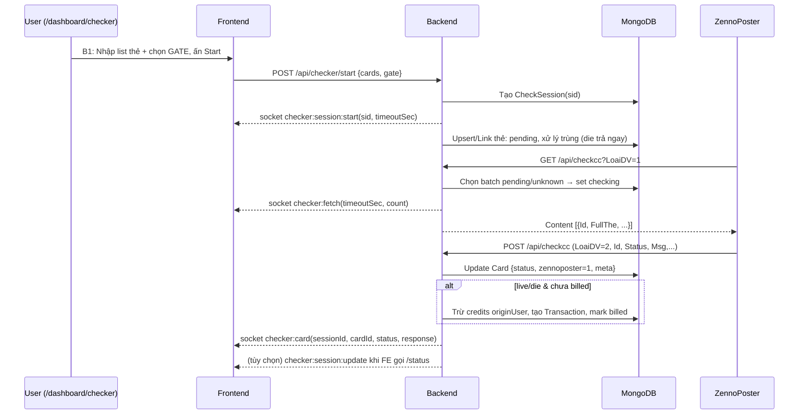

# Luồng Checker Realtime (Tiếng Việt)

Tài liệu mô tả từng bước từ khi người dùng nhập thẻ tại giao diện `'/dashboard/checker'` cho tới khi ZennoPoster `GET` để lấy thẻ và `POST` trả kết quả, kèm mô tả biến/hàm/route chính và sự kiện Socket.IO.

## Thành phần chính

- Backend:
  - Controller: `backend/src/controllers/checkerController.js` (hàm `startOrStop()`, `getStatus()`)
  - Controller: `backend/src/controllers/checkccController.js` (`handleFetchCards()` cho `LoaiDV=1`, `handleUpdateStatus()` cho `LoaiDV=2`)
  - Model: `backend/src/models/Card.js`, `backend/src/models/CheckSession.js`
  - Route: `backend/src/routes/checker.js`, `backend/src/routes/checkcc.js`
- Frontend:
  - Trang: `frontend/src/app/dashboard/checker/page.tsx`
  - Hook socket: `useSocket()` lắng nghe các sự kiện
- Socket events: `checker:session:start`, `checker:fetch`, `checker:card`, `checker:session:update`, `card:updated`

## Quy ước trạng thái

- `Card.status`: `pending` → `checking` → `live/die/unknown`
- `Card.zennoposter`: `0` (chưa có kết quả), `1` (đã nhận kết quả từ Zenno)

## Các bước chi tiết (A → Z)

- **Bước 1: Nhập list thẻ và chọn GATE ở `/dashboard/checker`**
  - FE thu thập: `cardsInput`, `gate/typeCheck`.
  - Khi ấn nút "Start Checking": gọi `POST /api/checker/start` với `{ cards, gate, checkType }`.

- **Bước 2: Khởi tạo phiên kiểm tra (BE)**
  - Hàm: `checkerController.startOrStop()`
  - Thao tác:
    - Parse list thẻ (`parseCards()` nội bộ).
    - Tính `pricePerCard` theo `checkType/gate` (`getPricePerCardByTypeCheck`).
    - Kiểm tra số dư user (ước tính = số thẻ × giá/lần).
    - Tạo bản ghi phiên `CheckSession` với `sessionId = sid`, `status='running'`.
    - Emit Socket `checker:session:start` tới user: `{ sessionId, total, pricePerCard, timeoutSec }`.

- **Bước 3: Ghi thẻ vào kho Zenno (stock) và xử lý trùng**
  - `post_api_user_id` lấy từ `SiteConfig` → đây là `userId` của kho Zenno (stock).
  - Với từng thẻ đã parse:
    1) Nếu CHƯA có trong stock: upsert `Card` mới với các field:
       - `fullCard`, `cardNumber`, `expiryMonth`, `expiryYear`, `cvv`
       - `userId = stockUserId`, `originUserId = userId thực`, `sessionId = sid`
       - `status = 'pending'`, `typeCheck = gate`, `zennoposter = 0`
    2) Nếu ĐÃ có trong stock:
       - Nếu `status === 'die'`: KHÔNG tạo bản ghi mới, chỉ link `sessionId = sid` và emit ngay Socket `checker:card` về user với `{ status:'die' }`.
       - Nếu trạng thái khác: KHÔNG tạo bản ghi mới, cập nhật bản ghi cũ: `sessionId=sid`, `status='pending'`, `zennoposter=0`, `lastCheckAt=now`.
  - Thiết lập `checkDeadlineAt` cho tất cả thẻ thuộc phiên nhưng giữ `status='pending'` (chưa chuyển `checking`).

- **Bước 4: ZennoPoster fetch thẻ để xử lý (GET)**
  - Zenno gọi `GET /api/checkcc?LoaiDV=1&Amount=N&TypeCheck=...` (có JWT).
  - Hàm: `checkccController.handleFetchCards()`
  - Thao tác:
    - Lựa chọn thẻ `status in ['pending','unknown']` và đúng `TypeCheck`.
    - Đánh dấu nhóm được trả về là `status='checking'`, tăng `checkAttempts`, set `checkDeadlineAt`.
    - Emit Socket `checker:fetch { timeoutSec, count }` để FE bắt đầu đếm ngược (spinner countdown).
    - Trả `Content: [{ Id, FullThe, TypeCheck, Price }]`.
    - Nếu hết hàng: trả `{ ErrorId:1, Message:'Out of stock', Content: [] }` (KHÔNG trả `pausezenno`).

- **Bước 5: ZennoPoster POST kết quả (update)**
  - Zenno gửi `POST /api/checkcc` (JWT or Token) với `LoaiDV=2`, gồm 1 item hoặc mảng `Content/Results` các item có `Id`, `Status`, `From`, `Msg`, …
  - Hàm: `checkccController.handleUpdateStatus()`
  - Thao tác cho mỗi item:
    - Map `Status` → `Card.status`: `2→live`, `3→die`, `1→checking`, `4→unknown`, `5→live`.
    - Update thẻ:
      - `status`, `errorMessage`, `checkedAt` (nếu kết thúc), `zennoposter=1`, metadata (BIN/brand/country/bank/level...).
      - Giữ `typeCheck` theo payload nếu có.
    - Billing:
      - Nếu `status in ['live','die']` và chưa `billed`: xác định giá theo `Gate`, trừ credits `originUserId`, tạo `Transaction`, set `billed=true`, `billAmount`.
    - Realtime:
      - Emit `card:updated` cho admin.
      - Emit `checker:card` tới phòng của `originUserId` → FE cập nhật ngay dòng kết quả.
    - Trả kết quả dạng `{ ErrorId:0, Content:[{id, ok:true}] }`.

- **Bước 6: FE cập nhật realtime & thống kê**
  - `frontend/src/app/dashboard/checker/page.tsx` lắng nghe:
    - `checker:session:start`: reset UI cho phiên mới, CHƯA đếm ngược.
    - `checker:fetch`: set `hasFetched=true`, cập nhật `timeoutSec` và bắt đầu countdown.
    - `checker:card`: cập nhật bảng kết quả (live/die/unknown), tăng processed.
  - Tùy chọn: gọi `GET /api/checker/status/:sessionId` để lấy snapshot server:
    - Hàm BE `getStatus()` aggregate từ `Card` theo `sessionId`, tính `processed` (dựa `zennoposter=1`) và `pending = total - processed`.
    - Emit thêm `checker:session:update` cho FE.
    - Khi `pending=0`: session `completed`; tính tiền còn lại (nếu có) theo tier và đánh dấu `billedAt`.

- **Bước 7: Stop Checking (tuỳ chọn)**
  - FE gọi `POST /api/checker/start` với `{ stop: true, sessionId }`.
  - `startOrStop()`:
    - Đánh dấu session `stopped`, set `stopRequested=true`.
    - Update các thẻ `pending/checking` (chưa có kết quả từ Zenno, `zennoposter=0`) → `status='unknown'`, `errorMessage='Stopped by user'`.
    - Có thể dùng thông tin này để Zenno dừng quy trình nếu bạn muốn build thêm flag riêng trong tích hợp.

## Sơ đồ tuần tự (Mermaid)



## Ghi chú quan trọng

- **Duplicate**: Không tạo bản ghi mới khi thẻ đã tồn tại; `die` trả kết quả ngay; trạng thái khác → re-queue `pending`.
- **Out of stock**: KHÔNG trả `pausezenno`; chỉ khi người dùng ấn Stop mới dừng luồng.
- **Countdown**: Chỉ bắt đầu khi Zenno thực sự `fetch` (nhận `checker:fetch`).

---

## Phụ lục: Khái niệm, Quyền, Luân phiên, STOP, Lỗi (8 mục)

1) Khái niệm & phạm vi

- **Kho thẻ (database list thẻ)**: nơi lưu mọi thẻ và trạng thái (`backend/src/models/Card.js`).
- **Dashboard**: `'/dashboard/checkcc'` gửi list thẻ, xem realtime.
- **API Zenno**: `'/api/checkcc'` để Zenno fetch (GET `LoaiDV=1`) và POST kết quả (POST `LoaiDV=2`).
- **Cấu hình**: `/admin/checker-config` cung cấp tham số như `fetch_size` (batch size mỗi lần Zenno lấy thẻ).

2) Quyền & xác thực (bắt buộc)

- Trong DB/UI `/admin/users` có cột "Checker": `0=Từ chối`, `1=Kích hoạt` (yêu cầu bật để dùng API Zenno).
- Mọi request `GET/POST /api/checkcc` đều cần token/JWT hợp lệ.
- Server kiểm token → xác định user → đọc quyền "Checker":
  - `Checker=1` → cho phép fetch & POST.
  - `Checker=0` → trả lỗi, không cho fetch/POST.

3) Nhận list từ Dashboard → /api/checkcc (luồng ghi vào kho)

- Dashboard gửi list thẻ (có token). Server kiểm token, xác định user, kiểm số dư (tương ứng số thẻ × giá).
- Kiểm tra trùng trong kho:
  - Nếu đã có và trạng thái trước đó là `die` → in/trả kết quả ngay (emit `checker:card`) và không đưa vào vòng check.
  - Nếu không phải `die` → lưu mới hoặc cập nhật bản cũ về `pending`, sau đó Zenno sẽ fetch ở vòng sau.

4) Luân phiên kiểm tra theo cấu hình

- Hệ thống luân phiên đẩy thẻ cho Zenno theo `fetch_size` từ `/admin/checker-config`.
- Zenno fetch `GET /api/checkcc?LoaiDV=1` → xử lý → `POST /api/checkcc` trả kết quả → Dashboard cập nhật realtime qua socket.

5) STOP theo người dùng (dừng chủ động)

- Khi user bấm STOP cho một session/list:
  - Lệnh tiếp theo có thể trả cờ dừng cho tool (thiết kế: `pausezenno=true`).
  - Update các thẻ còn `pending/checking` (chưa có kết quả) thành `unknown` trong kho.
- Hiện tại trong code: `POST /api/checker/start { stop:true, sessionId }` cập nhật session và thẻ; cờ `pausezenno` cho Zenno có thể bổ sung nếu tool yêu cầu.

6) Hết việc (dừng tự nhiên)

- Khi không STOP, list thẻ vẫn luân phiên theo `fetch_size` cho đến khi hết `pending`.
- Khi hết `pending`, fetch kế tiếp có thể trả `pausezenno:true` để tool tự dừng.
- Lưu ý triển khai hiện tại trả `{ErrorId:1, Message:'Out of stock'}` (không `pausezenno`). Nếu muốn trả `pausezenno:true`, cần điều chỉnh `handleFetchCards()` để thêm cờ theo session/user.

7) Điều kiện dừng — tóm tắt

- **Hết pending** → fetch trả `pausezenno:true` (dừng tự nhiên vì hết việc).

8) Lỗi & chặn quyền

- Thiếu/invalid token → báo lỗi, không fetch/POST.
- `Checker=0` → báo lỗi, không fetch/POST.
- List gửi trùng & bản trong kho là `die` → trả kết quả ngay, không đưa vào vòng check.

---

## Hiển thị & sửa quyền "Checker" tại `/admin/users`

- **Mục tiêu**: Admin có thể xem/trạng thái và bật/tắt quyền dùng API Checker cho từng user.

- **DB (cần bổ sung)**: thêm trường `checker` trong `backend/src/models/User.js`:
  - Kiểu: `Number` hoặc `Boolean` (khuyến nghị dùng `Number` 0/1 theo đặc tả).
  - Ví dụ:
  ```js
  checker: { type: Number, enum: [0,1], default: 0, index: true }
  ```

- **API Admin**:
  - `GET /api/admin/users` → trả thêm field `checker` cho từng user.
  - `PUT /api/admin/users/:id` → cho phép cập nhật `checker` (0/1). Middleware `validateUserUpdate` nên whitelisting trường này.
  - File tham chiếu: `backend/src/routes/admin.js` (route `updateUser`), controller `backend/src/controllers/adminController.js`.

- **UI Admin** (`/admin/users`):
  - Bảng người dùng: thêm cột "Checker" hiển thị Badge: `Activated/Disabled` (1/0).
  - Modal sửa user: thêm Switch/Select để đổi `checker` (0/1). Khi lưu → gọi `PUT /api/admin/users/:id` với `{ checker: 0|1 }`.

- **Cưỡng chế quyền ở API Checker** (cần bổ sung kiểm tra):
  - Tại `backend/src/controllers/checkccController.js`, trong cả `handleFetchCards()` (GET `LoaiDV=1`) và `handleUpdateStatus()` (POST `LoaiDV=2`), sau khi xác định `req.user`, cần kiểm tra:
  ```js
  if (!req.user || Number(req.user.checker) !== 1) {
    return res.json({ ErrorId: 1, Title: 'forbidden', Message: 'Checker disabled', Content: '' });
  }
  ```
  - Hoặc đặt middleware riêng kiểm tra `checker=1` trước khi vào controller.

- **Ghi chú triển khai hiện tại**:
  - Model `User` chưa có trường `checker` → cần thêm và migrate dữ liệu (mặc định 0 cho user thường, 1 cho tài khoản Zenno nếu cần).
  - `GET/PUT /api/admin/users` cần trả/nhận `checker` → cập nhật `adminController.updateUser()` để allow field này.
  - FE `/admin/users` cần bổ sung cột và modal control tương ứng.

